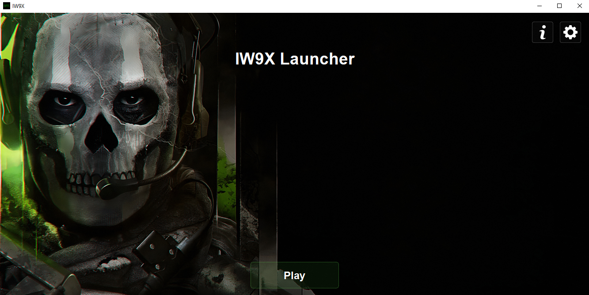

# IW9X Launcher

IW9X Launcher – Effortlessly run your cracked Modern Warfare II with zero crashes by automatically configuring services, managing bootstrapper processes



## Features

- **Automatic Service Configuration**: Configures the necessary services to run the game without crashes
- **Easy Game Launching**: Simplifies the process of starting the game with the correct parameters
- **Crack Installation**: One-click installation of the crack (Discord Game SDK DLL) with automatic backup system
- **Resource Auto-Download**: Automatically downloads missing UI resources
- **Command-line Support**: Launch the game directly with the `-play` option

## Installation

1. Download the latest release from the [Releases](https://github.com/mot204t/iw9x/releases) page.
2. Extract the files to a location of your choice.
3. Run `IW9X Launcher.exe` as administrator.

### Running from Source

If you want to run the application from source:

1. Clone this repository:
   ```
   git clone https://github.com/mot204t/iw9x.git
   ```
2. Install the required dependencies:
   ```
   pip install PyQt6
   ```
3. Run the main script:
   ```
   python main.py
   ```

## Usage

### GUI Mode

1. Start the launcher by running `IW9X Launcher.exe` or `python main.py`.
2. On first run, click the Settings button in the top-right corner.
3. Set your game directory by selecting the `cod.exe` file.
4. Install the crack by clicking the "Install Latest DLL File" button in Settings.
5. Click Save to return to the main screen.
6. Click Play to launch the game.

### Command-line Mode

To launch the game directly without showing the GUI:

```
IW9X Launcher.exe -play
```

or

```
python main.py -play
```

**Important Setup for Command-line Mode:**
- Before using the `-play` option, you must first configure your game directory either:
  1. Through the GUI by running the launcher normally and setting the path in Settings, or
  2. By directly editing the `settings.json` file and adding your game directory path to the `game_path` field:
     ```json
     {
       "game_path": "C:\Path\To\Your\Game\Directory"
     }
     ```
- The path must point to the directory containing `cod.exe` and `Randgrid.sys`
- Make sure you've installed the crack (Discord Game SDK DLL) through the Settings page before using command-line mode
- After configuring this path, you can launch the game directly with the `-play` option from any shortcut or command prompt

Note: The command-line mode is perfect for creating desktop shortcuts or Steam library integrations that launch directly into the game.

## Configuration

The launcher stores its configuration in a `settings.json` file in the same directory as the executable. This file contains:

- `game_path`: The path to your game directory containing `cod.exe`.

## Crack Installation

The launcher includes an option to install the crack (disguised as the Discord Game SDK DLL). This can be done through the Settings page by clicking the "Install Latest DLL File" button.

Key features of the crack installation:
- Automatic backup system that preserves previous versions of the DLL
- Sequential numbering of backups for easy tracking
- Verification of correct installation location

## Building from Source

To build the executable from source:

1. Install PyInstaller:
   ```
   pip install pyinstaller
   ```

2. Build the executable:
   ```
   pyinstaller --onefile --windowed --icon=iw9x/res/icon.ico main.py
   ```

## Requirements

- Windows 10 or later
- Python 3.6+ (if running from source)
- PyQt6 (if running from source)
- Administrator privileges (required for service configuration)

## License

This project is licensed under the MIT License - see the [LICENSE](LICENSE) file for details.

## Acknowledgements

- Developed by mot204t

## Disclaimer

This project is not affiliated with, maintained, authorized, endorsed, or sponsored by Activision or any of its affiliates.
